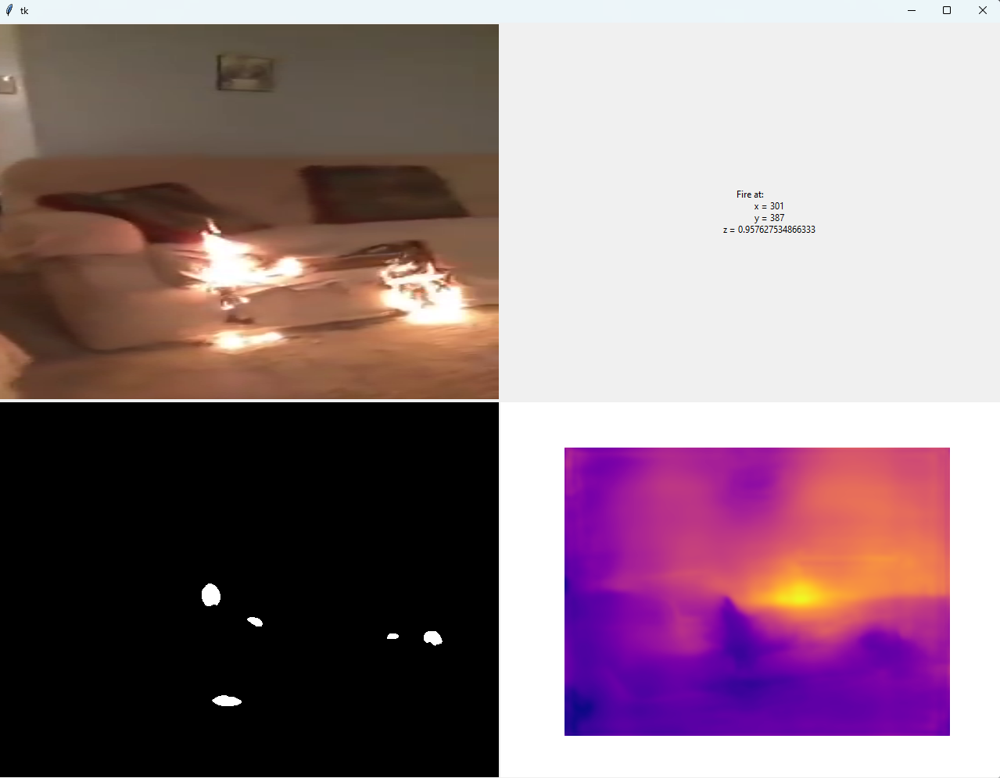

# Fire Detection System

## Usage: 
Run the following command to start monitoring a video feed:

```bash python ./video_stream_monitor.py --quit_character "QUIT CHARACTER" --threshold "THRESHOLD" --location "WHERE/TO/GET/VIDEO/FEED"```

### Parameters
* **--quit_character**: a single character which when pressed the app closes (default 'q').
* **--threshold**: a floating point number in the range [0, 1] representing the sensitivity of the model (default 0.4).
* **--location**: a path to the video feed source (could be path to a video file, 
camera sensor ip address, or None which makes the app try to connect to a camera recognised by the host device
(webcam if you're using a laptop)).

## Environment:
- CUDA 11.6
- CUDNN 8.3.1
- TensorFlow 3.10
- PyTorch 1.13
- OpenCV 4.7.0.72


## Results

Here is an example of the application in action:

```bash python .\video_stream_monitor.py --location "experiments/test_files/video 02.mp4"``` 

...
